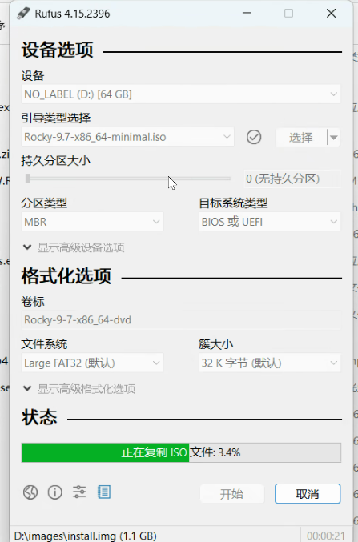

- Rufus 用ios做镜像的工具
- 备份用的321原则


- 工具

  fio 测试硬盘

  mdadm


# /home /etc什么的，内容写在哪里？

- 一段有趣的推理

  学习了磁盘阵列以后，我想到：硬盘应该是以某种方式挂载到linux文件系统中的。系统盘被lvm分成了3种逻辑卷，分别路径是/dev/rlm/下面的swap，root，和home。进入这个/dev/rlm目录下，发现swap，root，home是三个链接文件，链接到/dev/dm-2 /dev/dm-1 /dev/dm-0。进一步查证发现这三个文件是三个块文件，那么它们必然挂载到某个地方.通过lsblk发现，rlm-root被挂载到/目录下面。rlm-home被挂载到/home。rlm-swap被分成了swap分区。新的问题来了，那么我写在/home下面的文件，物理上是被保存到rlm-home这个逻辑分区下面的吗？也就是当出现挂载点出现包含关系的时候，率先写到更加“近”的目录下面对吗？那么问题又来了。如果/home被写满了，也就是rlm-home对应的逻辑空间满了，继续往里面写会发生什么？我推测会往rlm-home里面写吧

- gpt的答案

  ## 1. 写进 `/home` 的文件到底存在哪里？

  例如执行：

  ```
  echo hello > /home/test.txt
  ```

  数据经过的路径大致是：

  ```
  /home/test.txt
        ↓
  识别到 /home 是一个挂载点
        ↓
  进入 /dev/rlm/home 对应的文件系统
        ↓
  /dev/rlm/home 是指向 /dev/dm-* 的符号链接
        ↓
  device mapper 将逻辑卷映射到物理卷
        ↓
  最终写入 /dev/nvme0n1p2 对应的物理磁盘区域
  ```

  所以可以说：

  > `/home/test.txt` 在逻辑上保存在 `rlm-home` 逻辑卷的文件系统中，最终物理数据仍然落到 NVMe 硬盘上。

  LVM 并不是把数据存进一个普通“文件”里，而是把物理硬盘空间切分、映射成逻辑块设备。

  ## 2. 挂载点有包含关系时，系统选哪个？

  你说的“选择更近的目录”方向正确，更准确的说法是：

  > Linux 会选择与目标路径匹配得最具体、最长的挂载点。

  当前结构是：

  ```
  /       → /dev/rlm/root
  /home   → /dev/rlm/home
  ```

  所以：

  ```
  /etc/passwd
  ```

  只匹配到 `/`，写在 `rlm-root`。

  而：

  ```
  /home/user/a.txt
  ```

  同时可以匹配 `/` 和 `/home`，但 `/home` 更具体，所以写入 `rlm-home`。

  可以把它理解为：

  ```
  /                        rlm-root
  ├── etc                  rlm-root
  ├── var                  rlm-root
  ├── root                 rlm-root
  └── home                 这里切换到 rlm-home
      ├── user1            rlm-home
      └── user2            rlm-home
  ```

  不是先写到 `/` 再转移，而是内核解析路径时，走到 `/home` 就切换到了另一个文件系统。

  ## 3. `/home` 写满后会怎么样？

  假设：

  ```
  rlm-root：还有 20 GiB
  rlm-home：已经 100% 满
  ```

  继续执行：

  ```
  dd if=/dev/zero of=/home/bigfile bs=1M count=100
  ```

  通常会报：

  ```
  No space left on device
  ```

  即使根逻辑卷还有很多空间，Linux 也不会自动退回去使用 `rlm-root`。

  原因是：

  ```
  /home 只属于 rlm-home 文件系统
  /     只属于 rlm-root 文件系统
  ```

  两个逻辑卷是互相独立的块设备和文件系统。挂载点只是把它们组合成了一棵统一的目录树，并没有让剩余空间自动共享。

  因此，你最后一句应改成：

  > `/home` 没写满时，数据一直写入 `rlm-home`；写满后仍然只允许写 `rlm-home`，但由于没有可用空间，写操作会失败，不会自动使用 `rlm-root`。

  ## 4. 一个很关键的隐藏现象

  实际上，`rlm-root` 的根文件系统中，本来就存在一个普通的 `/home` 目录。

  挂载前：

  ```
  rlm-root 文件系统
  └── home/
  ```

  把 `rlm-home` 挂载到 `/home` 后：

  ```
  /home 原来的内容暂时被遮住
  现在看到的是 rlm-home 文件系统的根目录
  ```

  例如：

  ```
  umount /home
  ```

  卸载后，根文件系统里原本那个 `/home` 目录会重新显现。

  这会造成一种常见事故：

  1. `/home` 逻辑卷没有挂载成功；
  2. 用户没有发现；
  3. 继续向 `/home` 写大量数据；
  4. 数据实际上写进了 `rlm-root`；
  5. 最后把根分区 `/` 写满。

  因此服务器上经常使用这些命令确认挂载状态：

  ```
  findmnt /home
  df -hT / /home
  lsblk -f
  ```

  ## 5. swap 需要单独理解

  你说：

  > `rlm-swap` 被分成了 swap 分区。

  更准确地说：

  > `rlm-swap` 是一个逻辑卷，被初始化并启用为 swap 交换空间。

  它不一定是传统意义上的磁盘分区，也没有普通挂载点：

  ```
  /dev/rlm/swap
      ↓
  mkswap 初始化
      ↓
  swapon 启用
      ↓
  作为内存不足时的交换空间
  ```

  可以查看：

  ```
  swapon --show
  ```

  普通文件系统是：

  ```
  mount /dev/rlm/home /home
  ```

  swap 则是：

  ```
  swapon /dev/rlm/swap
  ```

  所以 `lsblk` 显示：

  ```
  rlm-root   /
  rlm-home   /home
  rlm-swap   [SWAP]
  ```

  ## 6. 你这台机器还有一个重要情况

  你的 `pvdisplay` 显示：

  ```
  Free PE    0
  Allocatable yes (but full)
  ```

  表示卷组中的物理空间已经全部分配给：

  ```
  rlm-root
  rlm-home
  rlm-swap
  ```

  因此，假如 `/home` 写满，现在不能直接从卷组中扩容，因为 VG 已经没有空闲 PE。

  通常需要：

  ```
  扩大底层磁盘或分区，再执行 pvresize
  ```

  或者：

  ```
  添加新的磁盘 → pvcreate → vgextend → lvextend
  ```

  最后记住这个模型：

  ```
  目录路径
     ↓ 通过最长挂载点匹配
  文件系统
     ↓
  逻辑卷 LV
     ↓
  卷组 VG
     ↓
  物理卷 PV
     ↓
  真实磁盘
  ```

  而挂载只是完成：

  ```
  某个目录入口 → 某个文件系统
  ```

  它不会让不同文件系统之间自动借用剩余空间。


# 快照的本质是记了新增加减的数据。


# 用mdadm构建磁盘阵列，如果已有的磁盘上有数据了会发生什么？

## 一、已有磁盘有数据，创建 RAID 会发生什么

假设：

```
mdadm --create /dev/md0 \
  --level=1 \
  --raid-devices=2 \
  /dev/nvme0n2 /dev/nvme0n3
```

这不是“把两个现有文件系统无损地合并起来”，而是：

```
原来的两块独立磁盘
        ↓
写入 RAID 元数据
        ↓
按照 RAID 规则重新解释磁盘上的扇区
        ↓
生成一个新的块设备 /dev/md0
```

原磁盘上的文件系统，例如 ext4、XFS，原本认为自己独占整块磁盘：

```
/dev/nvme0n2
├── 文件系统元数据
├── 目录信息
└── 文件数据
```

创建 RAID 后，Linux 不再把它当成独立文件系统使用，而是把它当成 RAID 成员：

```
/dev/nvme0n2 ─┐
              ├── RAID 驱动 ──> /dev/md0
/dev/nvme0n3 ─┘
```

之后应该在 `/dev/md0` 上创建文件系统：

```
mkfs.xfs /dev/md0
mount /dev/md0 /mnt/raid
```

而 `mkfs` 本身又会覆盖原文件系统元数据，因此通常意味着原数据被破坏。

## 二、为什么“原数据还在”，却读不到了

创建 RAID 时，不一定马上把整块磁盘全部清零。

很多情况下，原来的数据块可能暂时还躺在磁盘某些位置，但问题是：

1. 磁盘上的部分区域被写入了 RAID superblock；
2. 磁盘的逻辑布局发生了变化；
3. 原文件系统的起始位置或关键元数据可能被覆盖；
4. 数据开始按照条带、镜像或校验方式重新组织。

所以会出现：

```
物理比特可能部分还在
≠
文件系统还能正常识别
≠
文件还能正常恢复
```

可以把它类比成：

> 书的正文可能还在，但目录、页码和装订方式被改了，于是你不知道每一章在哪里。

因此，实际操作中应当视为破坏性操作，不能抱着“反正数据应该还在”的想法。

## 三、`mdadm` 到底是怎样做出磁盘阵列的

`mdadm` 主要负责配置和管理，真正执行 RAID 读写的是 Linux 内核里的 **MD（Multiple Devices）驱动**。

整体结构是：

```
文件系统
   ↓
/dev/md0
   ↓
Linux MD 软件 RAID 驱动
   ↓
多块成员磁盘
```

例如：

```
/dev/sdb ─┐
/dev/sdc ─┼──> /dev/md0
/dev/sdd ─┘
```

对上层文件系统来说，`/dev/md0` 就像一块普通的大硬盘。

文件系统并不知道下面有几块盘：

```
mkfs.xfs /dev/md0
mount /dev/md0 /mnt/data
```

文件系统只负责向 `/dev/md0` 发出：

```
读取第 1000 个块
写入第 2000 个块
```

MD 驱动再根据 RAID 级别决定具体访问哪些磁盘。

## 四、不同 RAID 是怎么组织数据的

### RAID 0：条带化

假设有两块盘：

```
数据块：A B C D E F

磁盘1：A   C   E
磁盘2：  B   D   F
```

写数据时轮流写入不同磁盘。

优点：

```
容量相加
读写速度提高
```

缺点：

```
任何一块盘损坏，整个阵列的数据都可能无法完整恢复
```

### RAID 1：镜像

```
磁盘1：A B C D
磁盘2：A B C D
```

每份数据都写两遍。

优点：

```
一块磁盘坏了，另一块通常还能继续工作
```

缺点：

```
两块 100 GB 磁盘，只有约 100 GB 可用空间
```

### RAID 5：条带加校验

三块磁盘示意：

```
磁盘1：A1  A2  P3
磁盘2：B1  P2  B3
磁盘3：P1  C2  C3
```

`P` 是校验信息，并且会分散到不同磁盘。

当一块磁盘损坏时，可以利用：

```
剩余数据 + 校验信息
```

计算出丢失的数据。

### RAID 10：先镜像，再条带

例如四块磁盘：

```
镜像组1：磁盘1 + 磁盘2
镜像组2：磁盘3 + 磁盘4

然后在两个镜像组之间条带化
```

它兼顾速度和可靠性，但至少需要四块盘。

## 五、RAID 元数据是什么

`mdadm` 会在成员磁盘上写入 RAID 元数据，也叫 RAID superblock。

里面会记录：

```
阵列 UUID
RAID 级别
成员磁盘数量
成员磁盘编号
阵列状态
事件计数
数据偏移位置
```

因此，即使重启后 `/dev/md0` 消失，系统也可以扫描各成员磁盘上的元数据，重新组装阵列：

```
mdadm --assemble --scan
```

这里要区分两个重要命令：

```
mdadm --create ...
```

表示：

> 创建一个新阵列，可能破坏原数据。

而：

```
mdadm --assemble ...
```

表示：

> 根据已有 RAID 元数据，重新组装原来的阵列。

如果磁盘本来就属于某个 RAID，通常应该 `assemble`，不能随便再次 `create`。

## 六、创建阵列后为什么通常还要 `mkfs`

创建 RAID 只得到一个块设备：

```
/dev/md0
```

这时它类似一块刚买来的裸硬盘，还不能直接按目录和文件使用。

还需要：

```
/dev/md0
   ↓ mkfs
文件系统
   ↓ mount
Linux 目录树
```

例如：

```
mkfs.xfs /dev/md0
mkdir /raid
mount /dev/md0 /raid
```

于是完整层次是：

```
/raid
  ↓ 挂载
XFS 文件系统
  ↓
/dev/md0
  ↓
MD 软件 RAID
  ↓
/dev/sdb /dev/sdc /dev/sdd
  ↓
物理磁盘
```

如果再叠加 LVM，可以变成：

```
目录
 ↓
文件系统
 ↓
逻辑卷 LV
 ↓
卷组 VG
 ↓
物理卷 PV
 ↓
/dev/md0
 ↓
RAID
 ↓
多块物理磁盘
```

也就是：

> RAID 解决多块磁盘怎样协同工作，LVM 解决存储空间怎样灵活划分。

## 七、实际操作前应该怎么做

在创建 RAID 之前，至少确认：

```
lsblk -f
blkid
mount
mdadm --examine /dev/nvme0n2
```

重点看：

```
磁盘上是否已有文件系统
是否正在挂载
是否已有 RAID 元数据
是否有重要数据
```

实验盘可以清空后使用，但生产环境必须先备份。

还应避免直接拿系统盘做实验，例如你的：

```
/dev/nvme0n1
```

它现在承载：

```
/boot
LVM root
LVM home
swap
```

对这种磁盘执行 `mdadm --create`，很可能直接破坏系统启动和数据。

一句话概括：

> `mdadm` 不是把已有磁盘中的文件“拼接”起来，而是把多块磁盘重新定义为一个新的块设备；原有数据布局通常与新 RAID 布局不兼容，所以创建阵列前应默认成员磁盘会被破坏。
