## linux文件系统

## linux中的一切都是文件。文件从‘/’开始

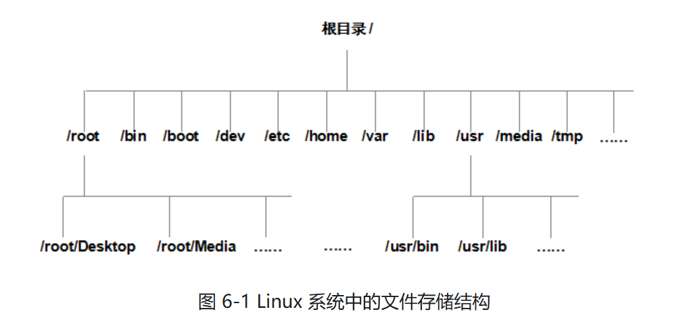

- FHS（Filesystem Hierarchy Standard）文件系统层次标准,指导用户把文件存到什么位置，怎么找到文件。

  | 目录名称    | 应该放置的文件内容                             |
  | ----------- | ---------------------------------------------- |
  | /boot       | 系统启动文件                                   |
  | /dev        | 硬件设备文件（这里有个黑洞null还记得吗？盒盒） |
  | /etc        | 系统和各个服务的配置文件                       |
  | /root       | 管理员家目录                                   |
  | /home       | 用户的家目录                                   |
  | /bin        | 基本的用户命令                                 |
  | /sbin       | 系统管理命令，给管理员用的                     |
  | /lib        | 系统的共享库，给/bin和/sbin命令使用            |
  | /media      | 挂载点目录，用于可移动设备                     |
  | /opt        | 第三方应用软件包                               |
  | /srv        | 服务数据目录，放网络服务的数据                 |
  | /tmp        | 临时文件目录，所有用户都可以访问               |
  | /proc       | 虚拟文件系统，提供进程和内核的信息             |
  | /usr/local  | 本地安装的软件和应用程序                       |
  | /usr/sbin   | 系统管理员使用的非基本管理命令                 |
  | /usr/share  | 共享数据，eg：文档和帮助文件                   |
  | /var        | 动态数据，eg：日志文件和临时文件               |
  | /lost+found | 文件系统回复区，存放丢失的文件碎片             |
  
  冷知识：usr 指的是unix system resources
  
  不是user哦！

## 文件系统
### 核心的三个概念

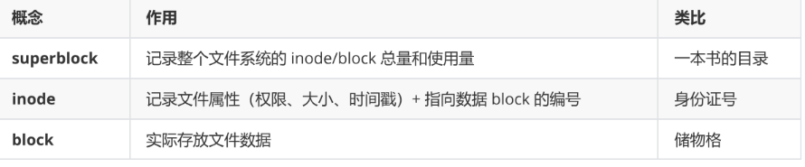

每个文件占用一个 inode，inode 中记录：

> 访问权限（rwx）、所有者与所属组
> 文件大小
> 时间戳（atime / mtime / ctime）
> 数据
>
> 所在的 block 编号

### 常见的文件系统

| 文件系统 | 特点                                    |
| -------- | --------------------------------------- |
| Ext4     | RHEL6 默认，支持 1EB，日志文件系统      |
| XFS      | RHEL7/8/9 默认，支持 18EB，宕机恢复极快 |

### VFS 虚拟文件系统

Linux 内核提供 VFS（Virtual File System）抽象层，用户操作文件时统一接口，无需关心底层是 ext4 还是 xfs。

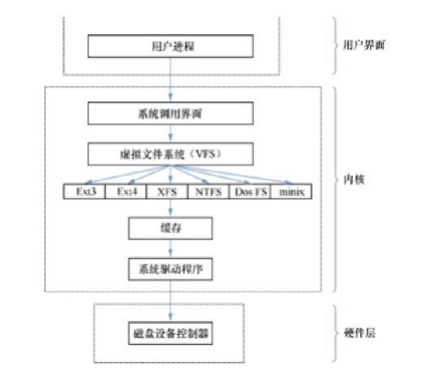


## 物理设备的命名规则

  linux内核的udev设备管理器的服务会一直以守护进程的形式运行并且侦听内核发出的信号来管理/dev目录下面的设备文件。

  

| 硬件设备        | 文件名称            |
| --------------- | ------------------- |
| IDE 设备        | /dev/hd[a-d]        |
| NVMe 设备(固态) | /dev/nvme[0-n]      |
| SCSI/SATA/U 盘  | /dev/sd[a-z]        |
| Virtio 设备     | /dev/vd[a-z]        |
| 软驱            | /dev/fd[0-1]        |
| 打印机          | /dev/lp[0-15]       |
| 光驱            | /dev/cdrom          |
| 鼠标            | /dev/mouse          |
| 磁带机          | /dev/st0 或/dev/ht0 |

由于现在的 IDE 设备已经很少见了，所以一般的磁盘设备都是以/dev/sd 开头。而一台主机上可能有多块磁盘，因此系统采用 a～z 来代表 26 块不同的磁盘（默认从 a 开始分配），此外，磁盘的分区编号也有讲究：

> 主分区或扩展分区的编号从 1 开始，到 4 结束；
>
> 逻辑分区从编号 5 开始。

### 硬盘设备命名

Linux 按接口类型使用不同前缀命名磁盘：

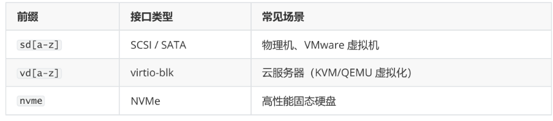

分区用数字标识，NVMe 的分区在磁盘名后加 p ：

> /dev/sda1 — 第一块 SCSI 硬盘的第一个分区
> /dev/vda2 — 云服务器第一块盘的第二个

 分区/dev/nvme0n1p1 — NVMe 硬盘，拆开看：

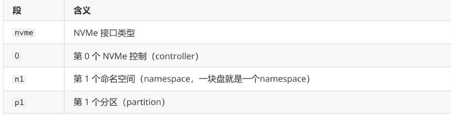

类比理解：假设你有一块 1TB 的 NVMe 固态硬盘：

> nvme0 — 主板上的 M.2 插槽（控制器）
> nvme0n1 — 插在上面的那块物理硬盘本身
> nvme0n1p1 — 这块盘上的 C 盘（系统分区）
> nvme0n1p2 — 这块盘上的 D 盘（数据分区）

分区编号规则：主分区从 1 开始，到 4 结束；逻辑分区从编号 5 开始。

## 分区表

为了让系统识别和管理硬盘上的不同分区，需要在硬盘头部写入分区表数据。目前有两种主流格式：

### MBR

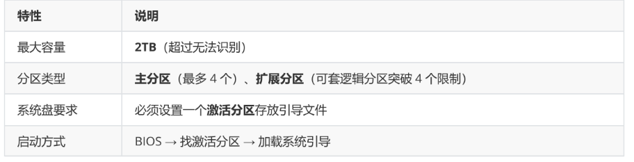

### GPT（GUID Partition Table）

| 特性       | 说明                                                       |
| ---------- | ---------------------------------------------------------- |
| 最大容量   | 18EB（目前无硬盘超此上限）                                 |
| 分区数量   | 理论上无限，Windows 最多 128 个                            |
| 系统盘要求 | 必须创建 EFI 分区（建议 512MB）存放引导文件                |
| 启动方式   | UEFI → 找 EFI 分区 → 加载系统引导（没有 EFI 分区开不了机） |


## **磁盘管理**

补充信息

​            1.     blkid命令可以方便查看uuid

​            2.     gpt所有分区都是平等的，没有区分，parted命令需要输入primary是历史遗留问题，mbr有主分区，最多4个，如果使用扩展分区，可以分出多个

​            3.     mb和mib是有区别的，mb进制1000，mib进制1024

​            4.     parted /dev/sda align-check opt 1  #检查分区标号为1的分区，是否满足optimal对齐，（起止扇区是2048的倍数，1mib对齐），如果输出1 aligned   代表 ✅ 通过最优标准

​            5.     分区可以使用%，这样便于parted自动处理对齐，提高读写性能


```
[root@localhost ~]# parted /dev/sda mkpart primary 0% 10%
信息: 你可能需要 /etc/fstab。
 
[root@localhost ~]# parted /dev/sda mkpart primary 10% 20%
信息: 你可能需要 /etc/fstab。
 
[root@localhost ~]# parted /dev/sda mkpart primary 20% 30%
信息: 你可能需要 /etc/fstab。
 
[root@localhost ~]# parted /dev/sda mkpart primary 30% 40%
信息: 你可能需要 /etc/fstab。
 
[root@localhost ~]# parted /dev/sda mkpart primary 40% 50%
错误: 无法创建更多分区。
```


​            6.     Linux 内核中，每个磁盘块设备最多只预留 16 个分区号

​            7.     如果需要当作系统盘启动系统，必须分区；如果仅当作普通磁盘使用，并不需要分区

​            8.     mount注意挂在参数，默认是是rw，如果仅仅想只读挂载

```
# 只读挂在
mount -o ro /dev/sda1 /mnt/data
# 不用卸载，直接切换为只读
mount -o remount,ro /mnt/data
```

 ## 管理分区

- lsblk 查看块设备

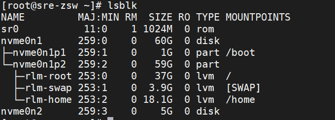

- blkid 查看设备的uuid

  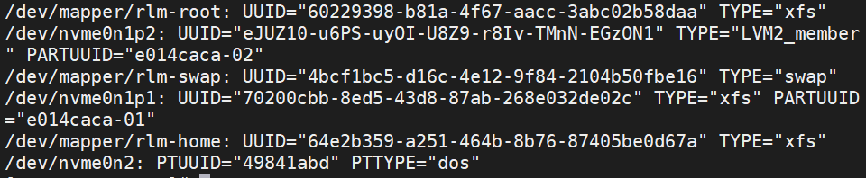

## fdisk工具——管理MBR分区

```shell
fdisk [磁盘名称]
```

按m可以查看参数，交互式管理

## parted工具

parted 操作`实时生效`，小心使用哦！

```
# 查看分区表
parted /dev/sdb print
# 创建 GPT 分区表
parted /dev/sdb mklabel gpt
# 创建 MBR 分区表（msdos = MBR）#parted /dev/sdb mklabel msdos
# 创建分区
#parted /dev/sdb mkpart primary 1 1G
parted /dev/sdb mkpart primary 0% 100% # 全盘分成一个区域额，从0%-到100%
# 创建扩展分区，剩余的50%-100%
parted /dev/sdb mkpart extended 50% 100%
# 删除分区
parted /dev/sdb rm 1
```

### partprobe ——刷新分区表

```shell
#分区操作后，通知内核重新读取分区表：
partprobe #建议执行，无负影响
```

## 格式与挂载

### 分区 + 格式化演示

```
[root@localhost ~]# fdisk /dev/nvme0n3Command (m for help): n → p → +1G → w
[root@localhost ~]# mkfs.ext4 /dev/nvme0n3p1
[root@localhost ~]# lsblk /dev/nvme0n3
NAME
MAJ:MIN RM SIZE RO TYPE MOUNTPOINTS
nvme0n3 259:4 0 5G 0 disk
└─nvme0n3p1 259:8 0 1G 0 part # 已建好分区并格式化
```

### mount挂载

- Linux 中，分区必须挂载到某个目录才能使用。

  ```
  mount 设备文件 挂载目录
  ```

  | 参数 | 作用                           |
  | ---- | ------------------------------ |
  | -a   | 挂载 /etc/fstab 中所有文件系统 |
  | -t   | 指定文件系统类型               |

- 临时挂载（重启失效）

  ```shell
  [root@localhost ~]# mkdir /mnt/data
  [root@localhost ~]# mount /dev/sdb1 /mnt/data
  ```

- 永久挂载 — /etc/fstab

  写入 /etc/fstab ，格式：

```
设备文件 挂载目录 文件系统类型 权限选项 是否备份 是否自检
```

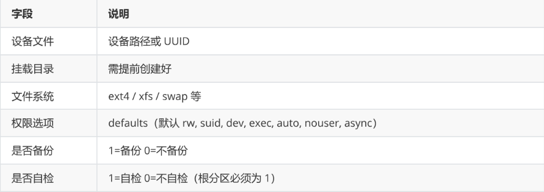

```shell
[root@localhost ~]# vim /etc/fstab
# 添加一行
/dev/sdb1 /mnt/data ext4 defaults 0 0
# 测试配置是否正确（配置错了重启会失败！）[root@localhost ~]# mount -a[root@localhost ~]# df -h/dev/sdb1
9.1G 37M 8.6G 1% /mnt/data
```

### umount — 卸载

```
umount 设备文件
# 或
umount 挂载点
```

### 挂载覆盖实验

```
# 格式化后，此时 /mnt/disk1 是 sda 上的目录
[root@localhost ~]# mkfs.ext4 /dev/sdb1
[root@localhost ~]# mkdir /mnt/disk1
[root@localhost ~]# touch /mnt/disk1/file0
[root@localhost ~]# ll /mnt/disk1/
-rw-r--r-- 1 root root 0 file0
# 挂载 sdb1，原目录内容被"遮盖"
[root@localhost ~]# mount /dev/sdb1 /mnt/disk1/
[root@localhost ~]# ll /mnt/disk1/
drwx------ 2 root root 16384 lost+found # file0 不见了！
# 在挂载状态下创建的文件，存在 sdb1 上
[root@localhost ~]# touch /mnt/disk1/file1
# 卸载后，原目录内容恢复，file1 随挂载消失[root@localhost ~]# umount /dev/sdb1[root@localhost ~]# ll /mnt/disk1/
-rw-r--r-- 1 root root 0 file0 # file0 回来了
```

### df / du — 查看磁盘使用

```SHELL
# df — 查看文件系统整体使用情况[root@localhost ~]# df -h文件系统
容量 已用 可用 已用% 挂载点
/dev/mapper/rlm-root 37G 1.7G 36G 5% /
/dev/sdb1
9.1G 37M 8.6G 1% /mnt/data
# du — 查看某个目录占用空间
[root@localhost ~]# du -sh /etc
23M /etc
```

### Swap 交换分区

> 当物理内存不足时，将暂时不用的数据临时存到硬盘，腾出内存给活跃程序使用。
> 生产环境中 swap 大小一般为物理内存的 1.5~2 倍

```shell
# 格式化 swap 分区
[root@localhost ~]# mkswap /dev/nvme0n2p1
# 启用 swap
[root@localhost ~]# swapon /dev/nvme0n2p1
[root@localhost ~]# free -h # 查看内容
# 关闭使用swapoff
# 永久生效：写入 fstab
[root@localhost ~]# vim /etc/fstab
/dev/nvme0n2p1 swap swap defaults 0 0
```

## 磁盘配额 Quota

限制用户或组能使用的磁盘空间。

### ext4 quota 实战

> 需求：创建 5 个用户 user1~user5，属组 usergrp，每人限制 250M 软限制 / 300M 硬限制。

### 1. 准备分区

```shell
[root@localhost ~]# fdisk /dev/nvme0n2 # 建一个 2G 分区Command (m for help): n → p → +2G → w
[root@localhost ~]# mkfs.ext4 /dev/nvme0n2p1
[root@localhost ~]# mkdir /mnt/mountpoint
[root@localhost ~]# mount /dev/nzvme0n2p1 /mnt/mountpoint
[root@localhost ~]# df -Th | grep mountpoint
/dev/nvme0n2p1 ext4 2.0G 24K 1.8G 1% /mnt/mountpoint
```

### 2. 准备用户

```
[root@localhost ~]# setenforce 0 # 临时关闭 SELinux[root@localhost ~]# groupadd usergrp
[root@localhost ~]# for i in {1..5}; do useradd -g usergrp -b /mnt/mountpoint user$i; done
```

### 3. 启用 quota 支持

```shell
# 重新挂载，添加 quota 选项
[root@localhost ~]# mount -o remount,usrquota,grpquota /mnt/mountpoint/
[root@localhost ~]# mount | grep mountpoint
/dev/nvme0n2p1 on /mnt/mountpoint type ext4 (rw,usrquota,grpquota)
# 安装 quota 工具
[root@localhost ~]# yum install -y quota
# 扫描并启用
[root@localhost ~]# quotacheck -avug
[root@localhost ~]# quotaon -avug
```

### 4. 编辑配额

```shell
[root@localhost ~]# edquota -u user1
```

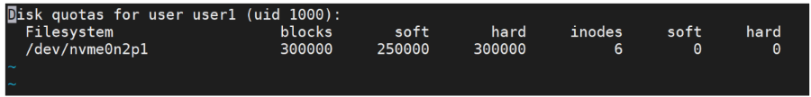

- soft（软限制）：达到后提醒，但仍允许在限额内继续使用
- hard（硬限制）：达到后强制拒绝写入

将 user1 的配额复制给 user2：

```
[root@localhost ~]# edquota -p user1 -u user2
```

查看限制情况：

```shell
[root@localhost ~]# repquota -asUser
used soft hard
user1 -- 16K 245M 293M
user2 -- 16K 245M 293M
```

### 5. 验证

```
[root@localhost ~]# su - user1
[user1@localhost ~]$ dd if=/dev/zero of=bigfile bs=10M count=50
# 写入到 293M 时被拦截
dd: error writing 'bigfile': Disk quota exceeded
[user1@localhost ~]$ du -sh
293M .
```

> XFS 文件系统使用 xfs_quota 工具，概念一致，命令格式略有不同，需要时查文档即可。

## 硬链接与软链接

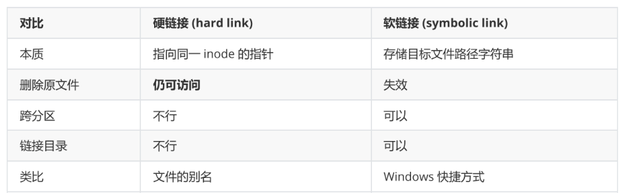

### ln 命令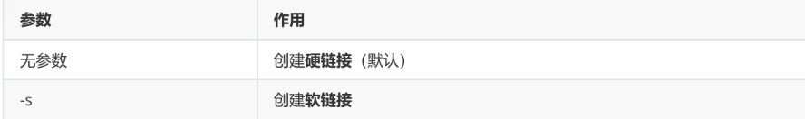

### 软链接演示

```
[root@localhost ~]# echo "hello linux" > testfile
[root@localhost ~]# ln -s testfile linkfile
[root@localhost ~]# cat linkfilehello linux
[root@localhost ~]# rm -f testfile
[root@localhost ~]# cat linkfile
cat: linkfile: No such file or directory # 原文件删除，链接失效
```

### 硬链接演示

```
[root@localhost ~]# echo "hello linux" > testfile
[root@localhost ~]# ln testfile linkfile
[root@localhost ~]# ls -l linkfile
-rw-r--r--. 2 root root 12 linkfile # 链接数 = 2[root@localhost ~]# rm -f testfile[root@localhost ~]# cat linkfile
hello linux # 原文件删除，硬链接仍然可读
```


## 创建linux没有的文件系统的bug

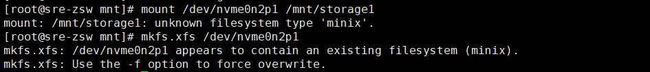

出bug了

- 原因在于：linux内核没有识别到minix文件系统，需要重新创建文件系统。加上-f参数可以成功过创建

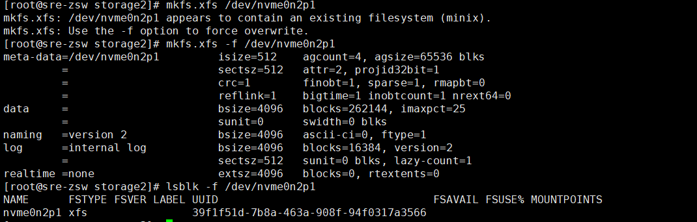

lsblk

df -Th

