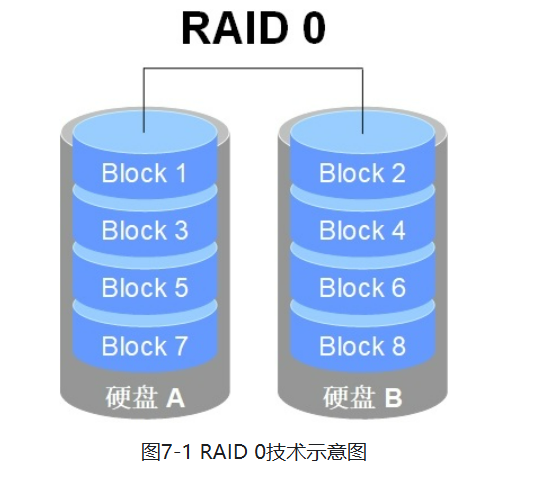
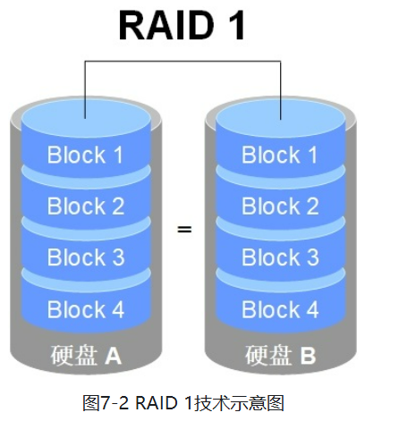
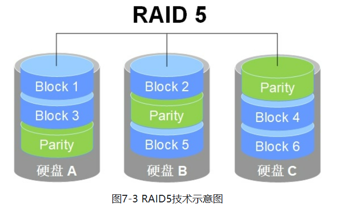
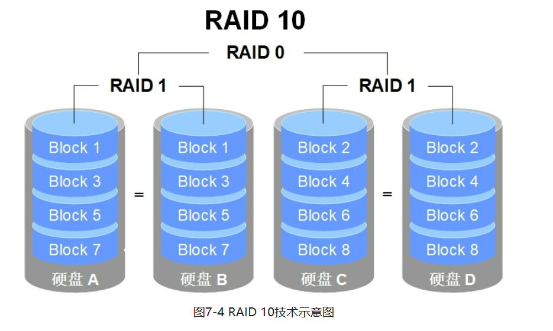
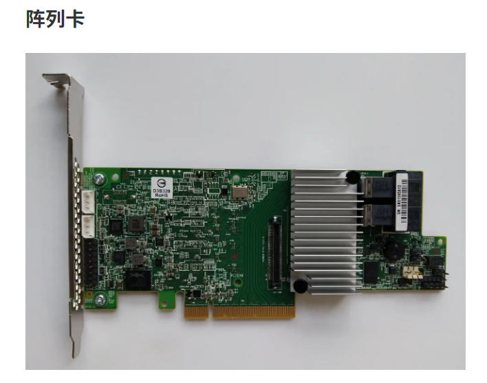
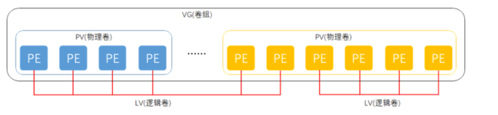

# RAID 

## RAID0**（条带化，Striping）**

- **特点**: 将数据分块并在多个磁盘上并行存储，提升读写性能。
- **优点**: 极大提高了读写速度，因为数据在多个磁盘上并行操作。
- **缺点**: 没有冗余，任何一个磁盘的损坏都会导致整个 RAID 失效，数据丢失。
- **适用场景**: 需要高性能、数据安全性需求不高的场景，比如视频编辑、临时数据存储等。




## **RAID 1（镜像,**

## **Mirroring）**

- **特点**: 将数据完全复制到另一块磁盘上，提供 1:1 的数据冗余。
- **优点**: 数据安全性高，任何一个磁盘损坏时，数据仍可以从镜像磁盘中恢复。
- **缺点**: 存储效率较低，实际可用存储空间为所有磁盘容量的一半。
- **适用场景**: 需要高数据可靠性和快速恢复的场合，比如数据库、操作系统磁盘等。



## **RAID 5（带奇偶校验的条带化，Striping with Parity）**

- **特点**: 将数据和奇偶校验数据分布在所有磁盘上，提供冗余的同时提升性能。
- **优点**: 提供数据冗余，同时存储效率较高（磁盘数量越多，效率越好），能够在一个磁盘损坏的情况下恢复数据。
- **缺点**: 写入性能稍差，尤其是在发生设备故障时，重建过程较慢。
- **适用场景**: 需要兼顾性能和数据冗余的场景，如文件服务器和应用服务器。
- 写性能*1，读性能\*（N-1）



## **RAID 10（RAID 1+0，镜像与条带化的组合）**

- **特点**: 将 RAID 1（镜像）和 RAID 0（条带化）结合使用，既提供数据冗余又提升了性能。
- **优点**: 既有 RAID 0 的高性能，又有 RAID 1 的高安全性。能够快速恢复数据。
- **缺点**: 存储效率较低，要求至少 4 块磁盘，实际可用空间为所有磁盘容量的一半。
- **适用场景**: 需要高性能和高冗余的关键应用场景，如数据库、虚拟化环境等。
- 读写性能*N（N为RAID0的硬盘数，此例为2），不能同时坏数据块1a与2a



## **硬件磁盘阵列（Hardware RAID）**

### 特点

- **专用硬件控制器**：硬件 RAID 使用专门的 RAID 控制器卡（RAID Controller），通常是插入主板的 PCIe 扩展卡或者集成在服务器主板上的芯片。该控制器管理磁盘阵列的所有操作并执行 RAID 级别的计算。
- **独立于操作系统**：硬件 RAID 完全独立于操作系统，RAID 控制器负责所有 RAID 相关操作，操作系统只看到一个逻辑磁盘。
- **硬件加速**：硬件 RAID 卡通常带有专用处理器（ASIC 或 FPGA）和缓存，用来加速 RAID 操作，提高性能



## **软件磁盘阵列（Software RAID）**

### **特点**

- **由操作系统实现**：软件 RAID 通过操作系统内核或专门的 RAID 软件来管理和实现 RAID 功能。Linux 的 `mdadm`、Windows 的动态磁盘管理和 macOS 的磁盘工具等都支持软件 RAID。
- **没有专用硬件**：软件 RAID 不需要专用的 RAID 控制器，所有 RAID 计算和管理工作都由主机的 CPU 执行。
- **灵活性高**：软件 RAID 通常可以在不同的硬件平台之间迁移，因为 RAID 配置数据存储在磁盘上，而不是特定的控制器中。

## **硬件 RAID 和软件 RAID 的对比**

| **对比项**   | **硬件 RAID**                            | **软件 RAID**                      |
| ------------ | ---------------------------------------- | ---------------------------------- |
| **实现方式** | 专用 RAID 控制器                         | 操作系统或软件实现                 |
| **性能**     | 高，特别是在 RAID 5/6 等级别中           | 较低，占用主机 CPU 资源            |
| **磁盘管理** | 独立于操作系统，系统只看到一个逻辑磁盘   | 依赖于操作系统的磁盘管理           |
| **成本**     | 高，需购买 RAID 控制器                   | 低，无需额外硬件                   |
| **功能支持** | 支持热备盘、硬盘监控、电池缓存等高级功能 | 功能较少，依赖操作系统提供的功能   |
| **灵活性**   | 依赖特定硬件，不易迁移                   | 容易迁移，跨硬件平台使用           |
| **故障恢复** | 控制器损坏可能需要相同型号的控制器       | 可以在不同硬件上恢复               |
| **适用场景** | 企业级、大型存储系统，数据中心           | 个人用户、小型服务器，开发测试环境 |

## *部署磁盘阵列*

###  mdadm磁盘整列

对于Linux上通过软件的形式构建磁盘整列，我们常用的方式是通过mdadm这个工具来完成。当然对于部分Linux发行版本，mdadm可能没有内置安装好，所以我们需要手动安装一下。

``` shell
root@localhost ~]# yum -y install mdadm
```

## mdadm命令（Multiple Devices）

常用参数以及作用

| 参数 | 作用             |
| ---- | ---------------- |
| -a   | 检测设备名称     |
| -n   | 指定设备数量     |
| -l   | 指定RAID级别     |
| -C   | 创建             |
| -v   | 显示过程         |
| -f   | 模拟设备损坏     |
| -r   | 移除设备         |
| -Q   | 查看摘要信息     |
| -D   | 查看详细信息     |
| -S   | 停止RAID磁盘阵列 |
| -x   | 备份盘数量       |

### 创建RAID

```SHELL
mdadm -Cv /dev/md0 -a yes -n 磁盘数量 -l RAID级别 磁盘列表
```

```shell
#RAID0
mdadm -Cv /dev/md0 -a yes -n 2 -l 0 /dev/nvme0n2 /dev/nvme0n3
#RAID1
mdadm -Cv /dev/md0 -a yes -n 2 -l 1 /dev/nvme0n2 /dev/nvme0n3
#RAID10
mdadm -Cv /dev/md0 -a yes -n 4 -l 10 
/dev/nvme0n2 /dev/nvme0n3 /dev/nvme0n4 /dev/nvme0n5
#RAID5+一块热备盘
mdadm -Cv /dev/md0 -n 3 -l 5 -x 1 
/dev/nvme0n2 /dev/nvme0n3 /dev/nvme0n4 /dev/nvme0n5
```

### 创建后：格式化、挂载

RAID 创建后，`/dev/md0` 就可以当作一块普通磁盘使用：

```
mkfs.ext4 /dev/md0
mkdir /mnt/RAID
mount /dev/md0 /mnt/RAID
df -h
```

````shell
#永久挂载
echo "/dev/md0 /mnt/RAID ext4 defaults 0 0" >> /etc/fstab
systemctl daemon-reload
mount -a
````

### 查看 RAID 状态

```
mdadm -D /dev/md0
```

- 重点看

  ```shell
  State              阵列整体状态
  Active Devices     正常参与工作的磁盘
  Working Devices    当前可工作的磁盘
  Failed Devices     故障磁盘数量
  Spare Devices      热备盘数量
  Chunk Size         条带块大小
  Rebuild Status     重建进度
  ```

### 模拟故障与修复

- 标记磁盘故障

  ``` shell
  mdadm /dev/md0 -f /dev/nvme0n2
  ```

- 从阵列移除故障盘

  ```shell
  mdadm /dev/md0 -r /dev/nvme0n2
  ```

- 添加新磁盘

  ```
  mdadm /dev/md0 -a /dev/nvme0n2
  ```

-  删除 RAID 阵列

  ```shell
  umount /dev/md0
  mdadm -S /dev/md0 #停止阵列
  #清除成员盘上的 RAID 元数据
  mdadm --zero-superblock /dev/nvme0n2 /dev/nvme0n3
  lsblk
  ```

  

###   fio 基础测试

```
fio --name=write_test \
--filename=/mnt/RAID/testfile \
--size=1G \
--bs=1M \
--rw=write \
--direct=1 \
--numjobs=1
```

### 核心速记

```
# 创建
mdadm -Cv /dev/md0 -n 2 -l 1 /dev/sdb /dev/sdc

# 查看
lsblk
mdadm -D /dev/md0
cat /proc/mdstat

# 使用
mkfs.ext4 /dev/md0
mount /dev/md0 /mnt/RAID

# 故障修复
mdadm /dev/md0 -f /dev/sdb
mdadm /dev/md0 -r /dev/sdb
mdadm /dev/md0 -a /dev/sdb

# 删除
umount /dev/md0
mdadm -S /dev/md0
mdadm --zero-superblock /dev/sdb /dev/sdc
```


# LVM磁盘阵列

## 概念



物理卷处于LVM中的最底层，可以将其理解为物理硬盘、硬盘分区或者RAID磁盘阵列，这都可以。卷组建立在物理卷之上，一个卷组可以包含多个物理卷，而且在卷组创建之后也可以继续向其中添加新的物理卷。逻辑卷是用卷组中空闲的资源建立的，并且逻辑卷在建立后可以动态地扩展或缩小空间。这就是LVM的核心理念。

PE最小存储单元，VG通过PV组合好PE，成一个整的；然后LV从VG分出来可供挂载使用

```
物理磁盘
   ↓ pvcreate
PV（物理卷）
   ↓ vgcreate
VG（卷组，容量池）
   ↓ lvcreate
LV（逻辑卷）
   ↓ mkfs
文件系统
   ↓ mount
挂载目录
```

## 三个核心对象

| 对象 | 全称            | 作用                         |
| ---- | --------------- | ---------------------------- |
| PV   | Physical Volume | 加入 LVM 的物理磁盘或分区    |
| VG   | Volume Group    | 由一个或多个 PV 组成的容量池 |
| LV   | Logical Volume  | 从 VG 中切出来的逻辑磁盘     |

容量单位：

- `PE`：PV/VG 中的基本分配单元，默认通常是 `4MiB`
- `LE`：LV 中对应的基本单元
- 通常可以理解为：`1 LE = 1 PE`

### 


## 部署逻辑卷

常用的LVM部署命令

| 功能/命令 | 物理卷管理 | 卷组管理  | 逻辑卷管理 |
| --------- | ---------- | --------- | ---------- |
| 扫描      | pvscan     | vgscan    | lvscan     |
| 建立      | pvcreate   | vgcreate  | lvcreate   |
| 显示      | pvdisplay  | vgdisplay | lvdisplay  |
| 删除      | pvremove   | vgremove  | lvremove   |
| 扩展      |            | vgextend  | lvextend   |
| 缩小      |            | vgreduce  | lvreduce   |

### 创建物理卷pv

```shell
#创建物理卷
pvcreate /dev/nvme0n2 /dev/nvme0n3
#展示物理卷
pvdisplay
```

### 创建物理卷组vg

```shell
#创建物理卷组
vgcreate storage /dev/nvme0n2 /dev/nvme0n3
#展示物理卷组
vgdisplay storage
```

### 创建逻辑卷组lv

```shell
#按照大小创建
lvcreate -n vo -L 150M storage
#按照PE数量创建
lvcreate -n vo -l 37 storage
```

### 格式化与挂载

```shell
mkfs.ext4 /dev/storage/vo
mkdir /mnt/vo
mount /dev/storage/vo /mnt/vo
```

- 永久挂载

```shell
echo "/dev/storage/vo /mnt/vo ext4 defaults 0 0" >> /etc/fstab
mount -a
```

  ### 扩容逻辑卷

分两步走:

1. 扩大 LV 块设备
2. 扩大其内部的文件系统

```shell
# 1. 卸载逻辑卷，避免扩容文件系统时仍被占用
umount /mnt/vo
# 2. 将逻辑卷 /dev/storage/vo 的总容量扩展到 290MB
# 注意：-L 290M 表示最终容量为 290MB，不是增加 290MB
lvextend -L 290M /dev/storage/vo
# 3. 强制检查并修复 ext 文件系统，确保扩容前文件系统状态正常
e2fsck -f /dev/storage/vo
# 4. 扩展文件系统，使其使用逻辑卷新增的空间
# resize2fs 不是“重建文件系统”，不会清空原有数据
resize2fs /dev/storage/vo
# 5. 将扩容后的逻辑卷重新挂载到 /mnt/vo
mount /dev/storage/vo /mnt/vo
```

- lvextend -L +290M表示在原容量上增加 `290M`。

### 缩小逻辑卷

```
umount /mnt/vo
e2fsck -f /dev/storage/vo
resize2fs /dev/storage/vo 120M
lvreduce -L 120M /dev/storage/vo
mount /dev/storage/vo /mnt/vo
```

### LVM 快照

```shell
#-s            创建快照
#-n SNAP       快照名称
#-L 120M       为快照变化数据预留的空间
lvcreate -L 120M -s -n SNAP /dev/storage/vo
```

### 恢复快照

```shell
#卸载原来的逻辑卷
umount /mnt/vo
#快照合并
lvconvert --merge /dev/storage/SNAP
#重新挂载
mount -a
```

恢复后：

- 原逻辑卷回到创建快照时的状态
- 快照卷通常会被自动删除
- 快照之后新增或修改的数据会丢失

### 删除 LVM

```shell
#卸载 → 删除 LV → 删除 VG → 删除 PV
umount /mnt/vo
#删除 /etc/fstab 中对应的挂载配置，然后：
lvremove /dev/storage/vo
vgremove storage
pvremove /dev/nvme0n2 /dev/nvme0n3
```

### 核心速记

```
# 创建
pvcreate /dev/nvme0n2 /dev/nvme0n3
vgcreate storage /dev/nvme0n2 /dev/nvme0n3
lvcreate -n vo -L 150M storage

# 使用
mkfs.ext4 /dev/storage/vo
mount /dev/storage/vo /mnt/vo

# 扩容
lvextend -r -L 6G /dev/storage/vo

# 缩容：必须先文件系统，后 LV
umount /mnt/vo
e2fsck -f /dev/storage/vo
resize2fs /dev/storage/vo 120M
lvreduce -L 120M /dev/storage/vo

# 快照与恢复
lvcreate -L 120M -s -n SNAP /dev/storage/vo
lvconvert --merge /dev/storage/SNAP

# 删除
lvremove /dev/storage/vo
vgremove storage
pvremove /dev/nvme0n2 /dev/nvme0n3
```


