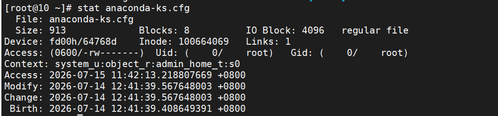
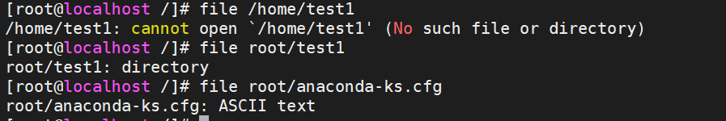

# 文件时间

## stat

```shell
export LANG="en_US.UTF-8"#改为英文系统环境
LANG="zh_CN.UTF-8"#中文

```

```shell
#用法： stat [选项]... 文件...
```

```shell
#例子
stat anaconda-ks.cfg
```

- 结果



- Access：访问时间，也叫 atime
  - 当文件被访问的时候，这个时间就会发生改变
  - Linux文件运行的时候查看文件又频繁数量又大，如果每次 atime 发生变化的时候都记入硬盘，或造成很大的压力。必须满足其中一个条件：
    - 自上次 atime 修改后，已达到 86400 秒
    - 发生写操作时
  
- Modify：修改时间，也叫 mtime
  - 当文件内容发生变化的时候，这个时间就会发生改变
  
- Change：改变时间，也叫 ctime
  - 当文件状态被改变的时候，这个时间就会发生修改
  
# 文件类型

- Linux 系统就根本不看文件的后缀名，你认为这个是什么文件，你就使用什么工具打开这个文件，如果打开错误，就会报错。

  ## 查看方法

  ### ls -l 

- 看第一个字符

  | 标识符 | 文件类型     |
  | ------ | ------------ |
  | -      | 普通文件     |
  | d      | 目录文件     |
  | b      | 块设备文件   |
  | c      | 字符设备文件 |
  | s      | 套接字文件   |

  ### file

- 专门用来查看文件类型

  

  

  ### stat


#  文件查找

## find命令

```shell
find [选项] [路径] [查找条件 + 处理动作]
  查找路径：指定具体目录路径，默认是当前文件夹
  查找条件：指定的查找标准（文件名/大小/类型/权限等），默认是找出所有文件
  处理动作：对符合条件的文件做什么操作，默认输出屏幕
```

## 按文件名查找

```shell
#绝对路径
find /root -name "anaconda-ks.cfg"
#相对路径
find -name "anaconda-ks.cfg"
#或者
find . -name "anaconda-ks.cfg"
```

## 按文件大小

```shell
#查找文件大小大于0的文件
find /root -size +0
#查找文件大小等于1的文件
find /root -size 1
#查找文件大小小于5M的文件
find /root -size -5M
```

## 指定查找的目录深度

```
find / -maxdepth 3 -a -name "anaconda-ks.cfg"
find / -mindepth 3 -a -name "anaconda-ks.cfg"
```

## 按时间找

```shell
[root@localhost ~]# find /etc -mtime +5        # 修改时间超过5天
[root@localhost ~]# find /etc -mtime 5        # 修改时间等于5天
[root@localhost ~]# find /etc -mtime -5        # 修改时间5天以内
```

## 按照文件属主、属组找 %

- 后面会详细讲

```shell
[root@localhost ~]# find /home -user xwz    # 属主是xwz的文件
[root@localhost ~]# find /home -group xwz
[root@localhost ~]# find /home -user xwz -group xwz
[root@localhost ~]# find /home -user xwz -a -group root
[root@localhost ~]# find /home -user xwz -o -group root
[root@localhost ~]# find /home -nouser        # 没有属主的文件
[root@localhost ~]# find /home -nogroup        # 没有属组的文件
```

## 按文件类型

```shell
find /root -type f #查找file文件类型的文件
find /root -type d #查找目录文件类型的文件
```

## 按文件权限 %

```shell
[root@localhost ~]# find / -perm 644 -ls
[root@localhost ~]# find / -perm -644 -ls    # 权限大于等于/包含644的
```

## 按正则表达式 %

```shell
[root@localhost ~]# find /etc -regex '.*ens[0-9][0-9][0-9].*'
# .*    任意多个字符
# [0-9]    任意一个数字
```


- 条件组合
  - **-a**：多个条件and并列
  - **-o**：多个条件or并列
  - **-not**：条件取反

## 处理动作 %

| 动作                     | 含义                                         |
| :----------------------- | :------------------------------------------- |
| `‐print`                 | 默认的处理动作，路径显示至屏幕               |
| `-ls`                    | 对查找到的文件执行 `ls ‐l` 命令              |
| `-delete`                | 删除查找到的文件                             |
| `-fls /path/to/filename` | 查找到的所有文件的长格式信息保存至指定文件中 |
| `{}`                     | 用于引用查找到的文件名称自身                 |
| `-exec`                  | 允许对找到的每个文件执行一个命令             |

## 相关案例 %

- 查找到root目录下面以.log结尾的文件，并且移动到/home/dir1中

```shell
[root@localhost ~]# find /root -name "*.log" -exec mv {} /home/dir1 \;
```

- 查找/var目录下属主为root，且属组为mail的所有文件或目录

```shell
[root@localhost ~]# find /var -user root -group mail
```

- 查找/usr目录下不属于root，bin或ftp用户的所有文件或目录

```shell
[root@localhost ~]# find /usr -not -user root -a -not -user bin -a -not -user ftp
[root@localhost ~]# find /usr -not \( -user root -o -user bin -o -user ftp \)
```

- 查找/etc目录下最近一周内容曾被修改过的文件或目录

```shell
[root@localhost ~]# find /etc -mtime -7
```

- 查找当前系统上没有属主或属组，且最近一周内曾被访问过的文件或目录

```shell
[root@localhost ~]# find / \( -nouser -o -nogroup \) -a -atime -7
```

- 查找/etc目录下大于1M且类型为普通文件的所有文件或目录

```shell
[root@localhost ~]# find /etc -size +1M -type f
```

- 查找/etc目录下所有用户都没有写权限的文件

```shell
[root@localhost ~]# find /etc -not -perm /222
```

- 查找/etc目录下至少一类用户没有执行权限的文件

```shell
[root@localhost ~]# find /etc -not -perm -111
```

- 查找/etc/init.d目录下，所有用户都有执行权限，且其它用户写权限的文件

```shell
[root@localhost ~]# find /etc/init.d -perm -113
```


  

  