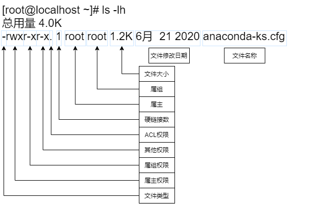

# 文件权限管理

## ugo权限模型

### **基础信息**


```
[root@localhost ~]# ls -al anaconda-ks.cfg.bak
-rwxrwxrwx. 1 root root 838 Jun 28 19:03 anaconda-ks.cfg.bak
```




重点关注rwx，acl权限，属主和数组

### **wx对文件和目录的影响**

- 这个部分重要，尤其是目录的含义

| 权限     | 对文件的含义        | 对目录的含义               |
| -------- | ------------------- | -------------------------- |
| r (读)   | 能看文件内容（cat） | 能看目录里有啥文件名（ls） |
| w (写)   | 能修改文件内容      | 能新建/删除/重命名文件     |
| x (执行) | 能当作程序运行      | 能进入该目录（cd）         |

### **chown修改文件属主和属组**

基本语法:

```shell
chown [选项] 新属主:新属组 目标
```

- 重中之重，避免死翘翘

-R: 处理指定目录以及其子目录下的所有文件（递归执行，一定要确认目录是不是目标目录，否则容易P0!!!否则容易P0!!!否则容易P0!!!)（还是别用比较好）

| **命令格式**          | **作用**                     | **示例**                        |
| --------------------- | ---------------------------- | ------------------------------- |
| chown user file       | 只改属主                     | chown nginx index.html          |
| chown :group file     | 只改属组                     | chown :www-data index.html      |
| chown user:group file | 同时改属主和属组             | chown nginx:www-data index.html |
| chown user: file      | 改属主，属组改成属主的默认组 | chown nginx: index.html         |

将目录下的所有文件拥有者设置为user01，允许使用的组设置为it


```
[root@localhost ~]# chown -R user01:it dir/*  # 注意，dir/*是匹配dir目录下所有文件，不包括dir
[root@localhost ~]# chown -R user01:it dir/   # 包括dir自己
```


### **chmod修改权限**

chmod [选项] 权限模式 目标文件/目录

#### **两种写法**

| 写法   | 示例                |
| ------ | ------------------- |
| 数字法 | chmod 755 script.sh |
| 符号法 | chmod u+x script.sh |


```
chmod u+x    file    # 属主加执行权限
chmod g-w    file    # 属组去掉写权限
chmod o+r    file    # 其他人加读权限
chmod a+x    file    # 所有人（u+g+o）加执行权限
```

```
#递归改整个目录
chmod -R 755 /app
# 高危操作，一定要确保/app是你需要改的范围
```

## **文件ACL访问控制列表**

### **背景**

前面我们讲了传统的 **u/g/o** 权限模型，它有一个致命缺陷：只能管**三类**人。

>  生产环境里，我们经常遇到这样的需求："让张三临时看一眼日志，但别动别的"，传统模型做不到，这时候就该 ACL 出场了。

所以u/g/o一般是通用的权限管理，而临时授权或者特批权限就需要acl来完成

### **两个核心命令**


```
getfacl    # 查看ACL
setfacl    # 设置ACL
```

| **命令**                      | **含义**          | **示例**                                |
| ----------------------------- | ----------------- | --------------------------------------- |
| setfacl -m u:用户名:权限 目标 | 给**用户**加ACL   | setfacl -m u:zhangsan:rw- file          |
| setfacl -m g:组名:权限 目标   | 给**组**加ACL     | setfacl -m g:devops:r-x /data/          |
| setfacl -x u:用户名 目标      | 删除特定用户的ACL | setfacl -x u:zhangsan file              |
| setfacl -b 目标               | **删除所有ACL**   | setfacl -b file（恢复纯传统权限）       |
| setfacl -R 目标               | **递归**设置ACL   | setfacl -R -m u:zhangsan:r-- /app/logs/ |
| getfacl 目标                  | 查看ACL           | getfacl /app/logs/                      |

```
setfacl -m u:zhangsan:--- file #这个命令可以让张三没有三个权限
```


### **案例**

​            \1.     创建sre-team组，创建sre-pjw用户归属sre-team

​            \2.     配置sre-pjw密码，切换至sre-pjw

​            \3.     用root用户创建/home/sre-pjw/hello.c，写上c的hello world

​            \4.     用root撤销hello.c other用户的r权限

​            \5.     登陆至sre-pjw用户尝试读取hello.c，提示无权限

​            \6.     返回root，使用acl给sre-pjw临时开放可读权限

​            \7.     登录sre-pjw尝试查看sre-team


```
[root@localhost project]# getfacl hello.c
# file: hello.c
# owner: root
# group: root
user::rw-
group::r--
other::---
 
[root@localhost project]# setfacl -m u:sre-pjw:r hello.c
[root@localhost project]# getfacl hello.c
# file: hello.c
# owner: root
# group: root
user::rw-
user:sre-pjw:r--
group::r--
mask::r--
other::---
```

 


### **acl权限继承**

我希望/project后续创建的所有文件，都自动给sre-pjw读权限：使用d参数，针对目录设置默认acl规则

- 这个案例有问题，别看了

```
# 设置默认ACL：未来新建的文件自动给zhangsan读权限
[root@localhost ~]# setfacl -m d:u:sre-pjw:rwx /project/
[root@localhost ~]# getfacl /project/
getfacl: Removing leading '/' from absolute path names
# file: project/
# owner: root
# group: root
user::rwx
group::r-x
other::r-x
default:user::rwx
default:user:sre-pjw:rwx
default:group::r-x
default:mask::rwx
default:other::r-x
# 输出会多一行：
# default:user:sre-pjw:rwx   ← 这个就是默认策略
 
# 示例创建新的hello.py
[root@localhost ~]# touch /project/hello.py
[root@localhost ~]# ls -al /project/
总用量 0
drwxr-xr-x+  2 root root  37  7月  5 17:10 .
dr-xr-xr-x. 19 root root 250  7月  5 16:43 ..
-rw-r--r--.  1 root root   0  7月  5 16:43 hello.c
-rw-rw-r--+  1 root root   0  7月  5 17:10 hello.py
 
# 查看hello.py
[root@localhost ~]# getfacl hello.py
# file: hello.py
# owner: root
# group: root
user::rw-
group::r--
other::r--
 
# sre-pjw用户是可以正常创建的
[sre-pjw@localhost ~]$ echo "print(1)" > /project/hello.py
[sre-pjw@localhost ~]$ cat /project/hello.py
print(1)
#sre-zhangsan用户创建
[root@localhost ~]# useradd sre-zhangsan -G sre-team
# sre-zhangsan用户是无法创建的
[sre-zhangsan@localhost ~]$ echo "aaa" > /project/hello.py
-bash: /project/hello.py: 权限不够
```


### **mask权限**

mask 权限，指的是用户或群组能拥有的最大 ACL 权限，也就是说，给用户或群组设定的 ACL 权限不能超过 mask 规定的权限范围，超出部分做无效处理。

比如下方示例，mask::rw- 所有所有用户和组的最大权限就是rw，不会有x，getfacl的输出已经提示了，只有#effective:rw-，仅rw生效


```
[root@192 project]# getfacl hello.py
# file: hello.py
# owner: root
# group: root
user::rw-
user:sre-pjw:rwx                #effective:rw-
group::r-x                      #effective:r--
mask::rw-
other::r--
```

 


修改mask为rwx，再观察acl信息

可以观察发现，确实不存在 #effective提示了


```
[root@192 project]# setfacl -m m::rwx hello.py
[root@192 project]# getfacl hello.py
# file: hello.py
# owner: root
# group: root
user::rw-
user:sre-pjw:rwx
group::r-x
mask::rwx
other::r--
```

 


需要注意，如果改变属组常规权限，mask会随之改变，因此chmod会影响mask。日常运维操作，如果chmod改变了，要注意acl规则是否需要手动调整

下图对比上图，如果g-x后，mask也减了x，对于sre-pjw，x权限就没了


```
[root@192 project]# chmod g-x hello.py
[root@192 project]# getfacl hello.py
# file: hello.py
# owner: root
# group: root
user::rw-
user:sre-pjw:rwx                #effective:rw-
group::r-x                      #effective:r--
mask::rw-   
other::r--
```

 


## **特殊权限SUID/SGID/STICKY**

### **suid**

使用场景：让执行这个文件的用户，暂时获得文件属主的身份权限

经典案例：/usr/bin/passwd


```
[root@192 project]# ls -al /usr/bin/passwd
-rwsr-xr-x. 1 root root 32656  5月 15  2022 /usr/bin/passwd
#  ^
#  这个s就是SUID，属主是root
```

 


| 没有SUID                                                     | 有SUID                                                      |
| ------------------------------------------------------------ | ----------------------------------------------------------- |
| 普通用户执行 passwd → 以普通用户身份运行 → 无法修改 /etc/shadow（属主root，权限600） | 普通用户执行 passwd → 以root身份运行 → 可以修改 /etc/shadow |

使用注意事项：

​            \1.     只对二进制文件有效  ‘ 这个点非常重要，别搞错了！！'

​            \2.     谁拥有这个文件，执行者就变成谁

​            \3.     没x权限，SUID位加上也没用

修改方式


```
chmod u+s /project/hello.py
chmod 4755 /project/hello.py # 前面的 4 = SUID
```

 


### **sgid**

在该目录下新建的文件/目录，自动继承该目录的属组，而不是创建者的主组。

文件上的SGID（不太常用）

目录上的SGID（常用）

经典案例：创建了一个/data/sre-team-share目录，我想让所有用户再此目录下创建的文件和目录都属于sre-team组 

使用root用户测试


```
[root@192 ~]# ls -al
...
-rw-r--r--.  1 root root     0  7月  5 17:09 hello.py
drwxr-x---.  2 root root     6  7月  1 17:04 project
...
 
[root@192 ~]# cd /data/sre-team-share/
[root@192 sre-team-share]# mkdir root-test
[root@192 sre-team-share]# touch root-hello.txt
[root@192 sre-team-share]# ls -al
总用量 0
drwxr-sr-x. 3 root sre-team 45  7月  7 21:32 .
drwxr-xr-x. 3 root root     28  7月  7 21:27 ..
-rw-r--r--. 1 root sre-team  0  7月  7 21:32 root-hello.txt  #文件属于sre-team
drwxr-sr-x. 2 root sre-team  6  7月  7 21:31 root-test #目录属于sre-team
```

 


修改方式


```
chmod g+s file
chmod 2755 dir（前面的 2 = SGID）
```


### **sticky**

> 即使有’目录‘的写权限，也只能删除/重命名属于自己的文件


```
[root@192 sre-team-share]# ls -ld /tmp
drwxrwxrwt. 11 root root 4096  7月  7 21:31 /tmp
#        ^ 标识sticky
```

 


修改方式


```
chmod 1777 /tmp/ （前面的 1 = Sticky Bit）
```

 


注意：**sticky对root不生效！！！**

这是默认正文标识符号

**文件上的SGID**（不太常用）：

## **chattr文件属性**

与U/G/O和ACL都不同，chattr是作用于文件或文件目录的，与用户无关，只要设置了规则，所有用户都一样对待。

示例：某一个重要文件，任何人不得删除


```
# 1. 创建一个测试文件
echo "hello" > test.txt
chmod 777 test.txt   # 所有人都能读写执行
 
# 2. 加上 i 属性（不可变）
chattr +i test.txt
 
# 查看属性
[root@192 ~]# lsattr test.txt
----i----------------- test.txt
 
# 3. 即使你是root，也动不了它
echo "world" >> test.txt
# 报错: bash: test.txt: Operation not permitted
 
rm -f test.txt
# 报错: rm: cannot remove 'test.txt': Operation not permitted
 
# 4. 必须先把i属性去掉
chattr -i test.txt
# 现在才能正常操作
```


重点：chattr 的权限检查在 UGO/ACL 之后执行，因此用户权限不管多大，都得遵守chattr属性

只需要记住两个核心参数

​                ● -i 不可变（重要的数据文件）

​                ● -a 仅追加，不能修改和删除（日志文件）

 **umask权限**

umask 是 Linux 给新文件/目录设置默认权限时的“减分项”或“遮罩”。它决定了“默认情况下，新建的文件/目录应该去掉哪些权限”。

基础计算公式如下


```
文件默认权限 = 666 - umask
目录默认权限 = 777 - umask
```


查看当前用于默认umask


```
[root@192 ~]# umask # 后面跟上3位数字就是设置umask
0022
 
# 第一个0忽略
umask = 0 2 2
        │ │ │
        │ │ └── 其他人（other）：减掉 2（写权限 w）
        │ └──── 属组（group）：减掉 2（写权限 w）
        └────── 属主（user）：不减（0）
 
所以：
  属主（user）：不减任何权限 → rwx
  属组（group）：减掉 w → r-x（即 rx）
  其他人（other）：减掉 w → r-x（即 rx）
```


创建文件和文件夹测试

> 默认创建的file是666 directory是777

```
[root@192 ~]# touch umask-file
[root@192 ~]# mkdir umask-dir
[root@192 ~]# ls -al
...
drwxr-xr-x.  2 root root     6  7月  7 21:56 umask-dir
-rw-r--r--.  1 root root     0  7月  7 21:56 umask-file
...
```


>  umask修改后再当前shell立即生效，重启后失效，如果想重启保持，需要写入配置文件


```
[root@localhost ~]# vim /etc/profile
+ umask 002
[root@localhost ~]# source /etc/profile        # 立即在当前shell中生效
```


课件中的脚本含义：“不是系统用户（普通用户）”并且“主组名 = 用户名（用户有自己的私有组）”给umask给002，否则给022

 

