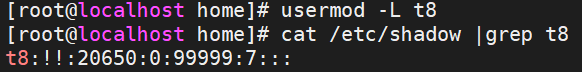
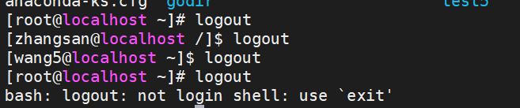
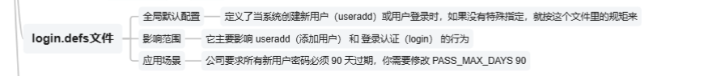
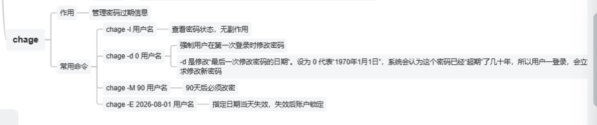

# 用户权限管理 理解为主

## id命令

```shel
id zhangsan #显示zhangsan的uid，gid，roup
```


## useradd命令

- useradd出来的用户并没有密码

  

  - 字段2表示密码认证处于锁定状态
  - 所以不能通过ssh连接直接登录
  - 但是root用户可以su过去

  添加密码 passwd wt190
  
  

 ```shell
 useradd [参数] 用户名 #用法
 ```

- 参数

  | 参数 | 作用                         |
  | ---- | ---------------------------- |
  | -d   | 指定家目录                   |
  | -e   | 账户的到期时间               |
  | -u   | 指定默认的UID                |
  | -g   | 指定一个初始的用户基本组     |
  | -G   | 指定一个或者多个扩展用户组   |
  | -N   | 不创建与用户同名的基本用户组 |
  | -s   | 指定该用户的默认shell        |

  ```shell
  #指定用户的目录（目录不存在自动创建，并初始化）
  useradd -d /home/t1home/ t1 
  #目录已经存在，则不进行初始化
  useradd -d /home/t1home/ t1 
  #指定张三基本组，则不会创建t4基本组了
  useradd -g zhangsan t4
  #t6，uid=1888，不登陆，指定目录/home/t6home
  useradd -u 1888 -s /sbin/nologin -d /home/t6home
  ```

## groupadd 命令

  - 用于创建新的用户组
  
    ```shell
    group [参数] 群组名
    ```

  ## usermod 命令

- 非常重要的-a 不加是覆盖的意思哦！！

 ```shell
 #把zhangsan加到root组
 usermod -a -G root zhangsan
 #会覆盖张三已经在的root组
 usermod -G lisi zhangsan
 ```


   - 用于修改用户属性(user modify)

     ```shell
     usermod [参数] 用户名
     ```

     | 参数  | 作用                                       |
     | ----- | ------------------------------------------ |
     | -c    | 备注信息                                   |
     | -d -m | 重新指定用户的家目录并且把旧的数据转移过去 |
     | -e    | 账户的到期时间                             |
     | -g    | 变更所属的用户组                           |
     | -G    | 变更附加的用户组                           |
     | -L    | 锁定用户(的密码)禁止其登录系统             |
     | -U    | 解锁用户，允许其登录系统                   |
     | -s    | 变更默认终端                               |
     | -u    | 修改用户的UID                              |

```shell
#锁定用户t8的密码
usermod -L t8
```




```
#解锁
usermod -U t8
```

```shell
#不让登录
usermmod -s /sbin/nologin t10
```

## passwd命令

- 修改用户密码，过期时间等信息

  ```shell
  passwd [参数] 用户名
  ```

  root管理员可以修改所有用户的密码

| 参数    | 作用                                                 |
| ------- | ---------------------------------------------------- |
| -l      | 锁定用户密码，禁止登录                               |
| -u      | 解除锁定，允许用户登录                               |
| --stdin | 允许通过标准输入修改用户密码                         |
| -d      | 使该用户可以使用空密码登录                           |
| -e      | 强制用户下次登录修改密码                             |
| -S      | 显示用户的密码是否被锁定，以及密码采用的加密算法名称 |

```shell
#修改t10的密码
passwd t10
```

封锁和解锁用户的两种方法:

```shell
usermod -U t10
usermod -L t10
passwd -l t10
passwd -u t10
#本质是修改/etc/shadow中用户的密码字段，让密码校验必然失败或者重新恢复。因此没有设置密码的用户在封锁之后是无法直接解锁的，因为他压根就没有设置过密码！
```

## userdel命令

```shell
userdel [参数] 用户名
```

| 参数 | 作用                 |
| ---- | -------------------- |
| -f   | 强制删除用户         |
| -r   | 同时删除用户和家目录 |

- 删除用户的时候，建议保留家目录数据。以免重要数据被删除！等确定不再使用的时候删除即可！

- 原则上不建议习惯添加rf参数！！如果一定要彻底删除的话分为两个步骤：
  1.   userdel删除用户的账户
  2. 使用rm命令删除家目录文件
     - 目的是为了形成操作的缓冲机制，避免误操作！

# sudoers

- 用于提权

- sudo命令执行过程

1. 当用户执行sudo时，系统会主动寻找`/etc/sudoers`文件，判断该用户是否有执行sudo的权限
2. 确认用户具有可执行sudo的权限后，让用户输入用户自己的密码确认
3. 若密码输入成功，则开始执行sudo后续的命令

- 赋予用户sudo操作权限

  通过useradd添加的用户，并不具备sudo权限。在ubuntu/centos/RockyLinux等系统下, 需要将用户加入admin组或者wheel组或者sudo组。以root用户身份执行如下命令, 将用户加入wheel/admin/sudo组。

  ```shell
  usermod -a -G wheel <用户名>
  ```

  如果提示wheel组不存在, 则还需要先创建该组

  ```shell
  groupadd wheel
  ```

## su的本质



## 解释

```
最外层：root
   └── su 到 wang5
         └── su 到 zhangsan
               └── su 到 root   ← 你截图开始时所在的位置
```

- su命令的本质: 启动另一个用户的shell

- 退出可以用exit


## 配置文件

**配置文件**

配置文件位于/etc/sudoers，编辑要使用visudo，此文件中授权规则


```
who   where = (as_whom)   what
#  who (谁)：授权的主体。可以是单个用户名（如 alice），或以 % 开头的用户组
# where (在哪)：规则生效的主机。通常设为 ALL，表示在本机生效
# (as_whom) (以谁的身份)：执行命令时模拟的用户。默认为 root，也可以是其他用户
# what (做什么)：允许执行的命令列表。必须使用命令的绝对路径
 
# 例如以下配置
%wheel ALL=(ALL) ALL
# 这表示 wheel 组的成员可以在任何地方以任何用户身份执行任何命令
```

 


**新增配置方案**

一般可以直接在/etc/sudoers.d/文件夹下创建新的配置文件，此目录下的所有配置会被自动加载

例如创建一个sre-team文件专门存储sre相关用户组配置


```
# 为 SRE 团队创建一个专用文件
sudo visudo -f /etc/sudoers.d/sre-team
 
# 允许 sre-team 组的成员以任何用户执行任何命令
%sre-team ALL=(ALL) ALL
 
# 允许监控用户无密码重启 Nginx
%monitoring ALL=(ALL) NOPASSWD: /usr/bin/systemctl restart nginx
```


检查当前用户sudo授权了哪些权限


```
sudo -l
```

 


 


# login.defs文件



- `/etc/login.defs` 是 Linux 中用于定义**用户账号与登录相关默认策略**的配置文件。

常见内容包括：

```
PASS_MAX_DAYS   99999
PASS_MIN_DAYS   0
PASS_WARN_AGE   7
```

表示：

- 密码最长有效期
- 修改密码的最小间隔
- 密码过期前多少天提醒

用户 ID 和组 ID 范围：

```
UID_MIN   1000
UID_MAX   60000
GID_MIN   1000
GID_MAX   60000
```

表示普通用户和普通组默认使用的 UID、GID 范围。系统用户通常使用更小的编号。

新建用户时的默认权限掩码：

```
UMASK 077
```

例如程序原本想创建权限为 `666` 的普通文件：

```
666 - 077 = 600
```

最终通常只有文件所有者可以读写。

还可能包含：

```
CREATE_HOME yes
USERGROUPS_ENAB yes
ENCRYPT_METHOD SHA512
```

分别表示：

- 创建用户时是否自动创建家目录
- 是否为用户创建同名私有组
- 密码使用哪种加密算法

查看有效配置时，可以用：

```
grep -Ev '^\s*#|^\s*$' /etc/login.defs
```

一句话理解：

> `login.defs` 定义的是“创建用户和管理登录账号时，系统默认采用什么规则”。


> 这个符号还挺好看
>
> 可以学习一下。是>这个符号。
>
> ` 当然还有这个` 

# chage





# **登录流程**

​            \1.     系统根据用户名查 /etc/passwd，获取 UID、GID 和家目录

​            \2.     接着查 /etc/shadow，核对用户输入的密码是否匹配加密哈希值

​            \3.     若匹配，则登录成功，并应用 /etc/group 中的组权限


