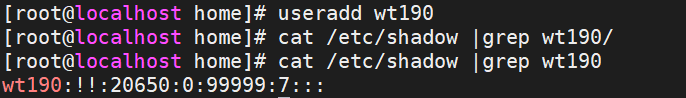
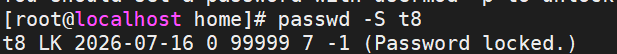

# 用户权限管理

## id命令

```shel
id zhangsan #显示zhangsan的uid，gid，roup
```


## useradd命令

- useradd出来的用户并没有密码

  

  - 字段2表示密码认证处于锁定状态
  - 所以不能通过ssh连接直接登录
  - 但是root用户可以su过去

  添加密码 passwd wt190
  
  

 ```shell
 useradd [参数] 用户名 #用法
 ```

- 参数

  | 参数 | 作用                         |
  | ---- | ---------------------------- |
  | -d   | 指定家目录                   |
  | -e   | 账户的到期时间               |
  | -u   | 指定默认的UID                |
  | -g   | 指定一个初始的用户基本组     |
  | -G   | 指定一个或者多个扩展用户组   |
  | -N   | 不创建与用户同名的基本用户组 |
  | -s   | 指定该用户的默认shell        |

  ```shell
  #指定用户的目录（目录不存在自动创建，并初始化）
  useradd -d /home/t1home/ t1 
  #目录已经存在，则不进行初始化
  useradd -d /home/t1home/ t1 
  #指定张三基本组，则不会创建t4基本组了
  useradd -g zhangsan t4
  #t6，uid=1888，不登陆，指定目录/home/t6home
  useradd -u 1888 -s /sbin/nologin -d /home/t6home
  ```

## groupadd 命令

  - 用于创建新的用户组
  
    ```shell
    group [参数] 群组名
    ```

  ## usermod 命令

   - 用于修改用户属性(user modify)

     ```shell
     usermod [参数] 用户名
     ```

     | 参数  | 作用                                       |
     | ----- | ------------------------------------------ |
     | -c    | 备注信息                                   |
     | -d -m | 重新指定用户的家目录并且把旧的数据转移过去 |
     | -e    | 账户的到期时间                             |
     | -g    | 变更所属的用户组                           |
     | -G    | 变更附加的用户组                           |
     | -L    | 锁定用户(的密码)禁止其登录系统             |
     | -U    | 解锁用户，允许其登录系统                   |
     | -s    | 变更默认终端                               |
     | -u    | 修改用户的UID                              |

```shell
#锁定用户t8的密码
usermod -L t8
```




```
#解锁
usermod -U t8
```

```shell
#不让登录
usermmod -s /sbin/nologin t10
```

## passwd命令

- 修改用户密码，过期时间等信息

  ```shell
  passwd [参数] 用户名
  ```

  root管理员可以修改所有用户的密码

| 参数    | 作用                                                 |
| ------- | ---------------------------------------------------- |
| -l      | 锁定用户密码，禁止登录                               |
| -u      | 解除锁定，允许用户登录                               |
| --stdin | 允许通过标准输入修改用户密码                         |
| -d      | 使该用户可以使用空密码登录                           |
| -e      | 强制用户下次登录修改密码                             |
| -S      | 显示用户的密码是否被锁定，以及密码采用的加密算法名称 |

```shell
#修改t10的密码
passwd t10
```

封锁和解锁用户的两种方法:

```shell
usermod -U t10
usermod -L t10
passwd -l t10
passwd -u t10
#本质是修改/etc/shadow中用户的密码字段，让密码校验必然失败或者重新恢复。因此没有设置密码的用户在封锁之后是无法直接解锁的，因为他压根就没有设置过密码！
```

## userdel命令

```shell
userdel [参数] 用户名
```

| 参数 | 作用                 |
| ---- | -------------------- |
| -f   | 强制删除用户         |
| -r   | 同时删除用户和家目录 |

- 删除用户的时候，建议保留家目录数据。以免重要数据被删除！等确定不再使用的时候删除即可！

- 原则上不建议习惯添加rf参数！！如果一定要彻底删除的话分为两个步骤：
  1.   userdel删除用户的账户
  2. 使用rm命令删除家目录文件
     - 目的是为了形成操作的缓冲机制，避免误操作！

# 文件权限管理


# su的本质


## 解释

```
最外层：root
   └── su 到 wang5
         └── su 到 zhangsan
               └── su 到 root   ← 你截图开始时所在的位置
```

- su命令的本质: 启动另一个用户的shell

- 退出可以用exit

  